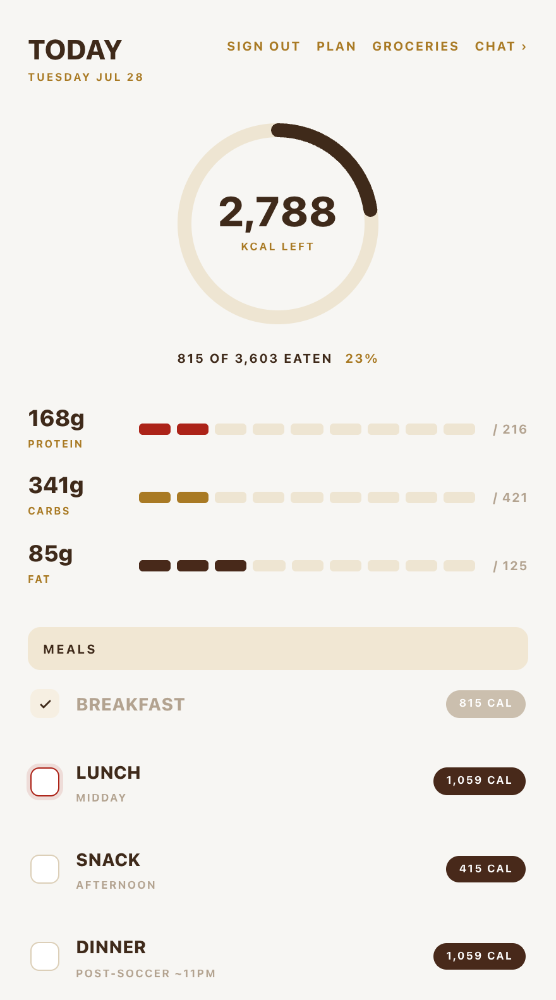

<p align="center"></p>

<p align="center"><b>179</b> tests · <b>11</b> tools · <b>10</b> tables · <b>1</b> user · MIT · <a href="https://github.com/godfreyponce/">github</a> / <a href="https://www.linkedin.com/in/godfreyponce/">linkedin</a> / <a href="https://godfreyponce.dev/">personal website</a></p>

> [!WARNING]
> This is my personal app. One user, one password, my meal plan. You can run it, but it will feed you my chicken and rice until you seed your own. Fork accordingly.

Kal is a Claude assistant with write access to my food log. It knows my profile, my meal plan, and what I have eaten today. Normal day: I tap a meal on the Today screen and it is logged. Off-plan day, which is the whole reason it exists: I tell it what I am about to eat, it finds real macros, rewrites today to fit, and logs what actually happened. The plan template is never touched.

<p align="center"></p>
<p align="center"><sub>the whole day on one screen. tap a meal, it's logged. tap again, it's not.</sub></p>

## `the loop`

```
phone (PWA) ──► POST /api/chat ──► claude haiku
                              │
                    tool loop, max 8 rounds
                              │
┌─────────────────────────────┼─────────────────────────────┐
log_food             search_nutrition (USDA + OFF)   override_meal
set_meal_status      fetch_page                      log_weigh_in
add_grocery          get_day_summary                 add_memory_fact
search_foods                                         get_weight_trend
└─────────────────────────────┼─────────────────────────────┘
                              ▼
               neon postgres (drizzle, 10 tables)
               every write gets an Undo button
```

The frontend only speaks to that route and plain REST. Swap the model with one env var. Prompt caching cuts a turn from $0.0057 to $0.0009; a full off-plan conversation costs about three cents, and the chat shows me the running total while I type.

## `the one rule`

The model once saw `6× Chicken breast`, guessed a serving size, and handed me a 372 g protein day. Never again:

> The model never sees a bare multiplier. Every food line arrives resolved: weight, unit, macros.

Numbers come from a curated grocery library of things I actually buy, with label macros. When something new comes up, the chat climbs a ladder: nutrition databases first, then a product link or a photo of the label, and only then an estimate, labeled as one, which I have to approve before it writes anything.

## `what is not here`

1. No accounts. There is no signup because there is no second user.
2. No UI library, no state library, no motion library. The sheets, springs, and rubber-band drags are hand-rolled CSS and pointer math. Reduced motion drops it all to fades.
3. No memory heroics. The chat keeps its last 30 messages and forgets the rest.
4. No CI yet. 179 tests across 25 files run locally as a commit gate.
5. No second timezone. Today is defined in mine.

## `run it`

> [!NOTE]
> `npm run db:seed` wipes the database and installs the starter plan. Tests hit the live database, not mocks.

```
git clone https://github.com/godfreyponce/kal
npm install
# .env.local: DATABASE_URL, ANTHROPIC_API_KEY, APP_PASSWORD, SESSION_SECRET
npm run db:seed
npm run dev
```

Setup, usage, and architecture live in [docs/](docs/). It runs my actual days at [kal-delta.vercel.app](https://kal-delta.vercel.app). The login page will tell you that you shall not pass. It means it.

<sub>MIT © 2026 Godfrey Ponce</sub>
